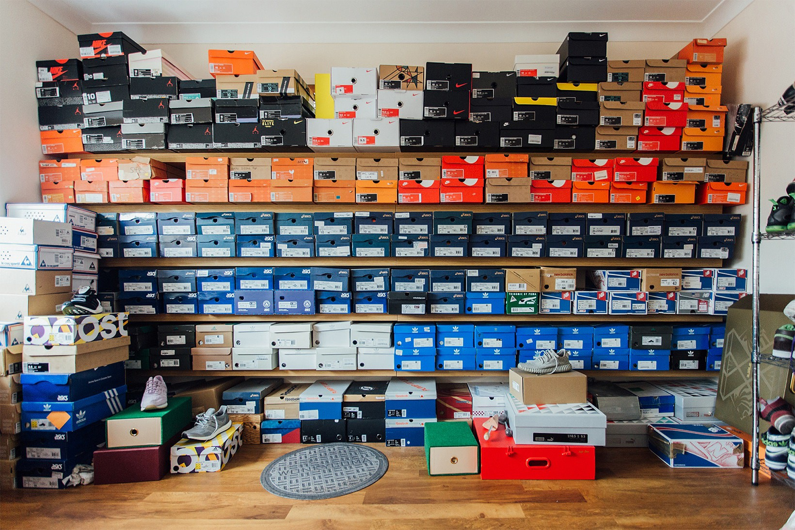

# Sneaker Data Scraping

# StockX Scraping:

The first part of this project is focused on scraping data from StockX. We focused on the 5 sections that were accessible from the navigation bar (Adidas, Air Jordan, Nike, Other Brands, and Luxury Brands). We collected the url keys for all the shoes available in each category, which we were then able to search based on the keys to gather more information about the individual shoes. We then were able to find the sku for each shoe which is essentially an ID number to identify the shoe. This sku ID would then allow us to scrape the interactive plot at the bottom of the shoe's page that would give us information on the past resale prices of that specific shoe.

# Reddit Scraping:

The second part of this project is focused on using PRAM to scrape Reddit. With the information we collected from the StockX portion we were able to create a list of all of the names of the sneakers. The issue was that for certain shoes there were many colorways for the same model name, so we reduced the list to only include unique shoe model names. After that we had 630 unique model names to work with which is when we decided to reduce it even more to a random sample of 30 shoes to focus on. We specified in our query that we wanted to search only on the subreddit r/Sneakers and then used the list of 30 shoe model names as keywords for grabbing posts. With that we extracted the texts, id number, and date/time of each post. Using the post id numbers we were then able to go one step further and grab the texts from the comments section, which is the data that we actually wanted to get.

# Price Prediction Using Stock X Historical Prices and Google Trends:
by Diego Fernández Zapico

To help make purchasing or selling decisions on a certain sneaker it might be usefull to consider how the price will change. This notebook aims to achieve just that.

In the previous notebook 'sneaker_scraping' a price history was obtained for the 'Name' you introduced. Now with that information, we intend to make an acurate prediction for the price of this shoe name. We use Time Series Analysis to build a model that makes predictions taking into account:

- past values of this price time series and
- a covariate obtained from Google Trends that represents the attention this shoe model gets.
The predictions are made 3 days ahead. So for any given day  𝑡 , we can get a value of price of day  𝑡+1 ,  𝑡+2  and  𝑡+3  (more on this later).

# Text Analysis on Reddit Comments:
by Carlos Ivan Madrigal Navarro

This section has the purpose of extracting qualitative information about the sneakers comments we scrapped from reddit, to have a better insight of which sneakers are worth spending on, and which ones are not (shoes are not cheap!).

Some of the information we would be interested in obtaining:

- Which are the most popular shoes?
- Do people like or dislike the shoe?
- What do the comments speak about the shoe?

Some of the techniques that we will use for achieving this goals are sentiment analysis, word2vec, lemmatization and topic modelling, among others.

